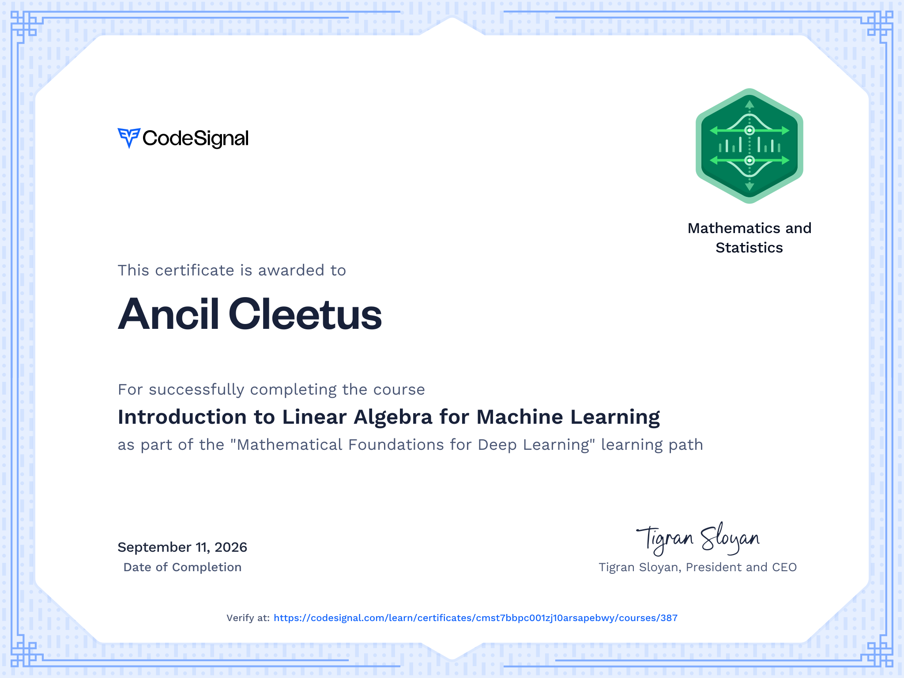

# **Mathematical Foundations for Deep Learning**

Unlock the power of machine learning with our expertly crafted courses in Linear Algebra, Calculus, Optimization Algorithms, and Probability & Statistics. Gain hands-on experience with essential mathematical tools and techniques, making complex models intuitive and optimization more effective.

## Course 1: Introduction to Linear Algebra for Machine Learning    

Linear algebra is the backbone of deep learning. This course provides a fundamental understanding of vectors, matrices, and their operations, which are essential for building and optimizing complex machine learning models.

## Course 2: Introduction to Calculus for Machine Learning    

Calculus is essential for understanding optimization in machine learning. This course introduces you to the fundamental concepts of calculus such as functions, limits, derivatives, and integrals.

## Course 3: Advanced Calculus for Machine Learning    

Advanced calculus concepts are crucial for understanding optimization and gradients in machine learning, particularly in multivariable scenarios. This course builds upon basic calculus to cover multivariable functions, their derivatives, and numerical methods for gradients.

## Course 4: Foundations of Optimization Algorithms    

Optimization is critical in machine learning to minimize loss functions. This course covers basic to advanced optimization algorithms, equipping you with the techniques needed to fine-tune machine learning models.

## Course 5: Introduction to Probability and Statistics for Machine Learning    

Probability and statistics form the foundation for understanding data and making informed decisions in machine learning. This course will focus on key concepts and techniques that hold significant importance in the realm of deep learning.

