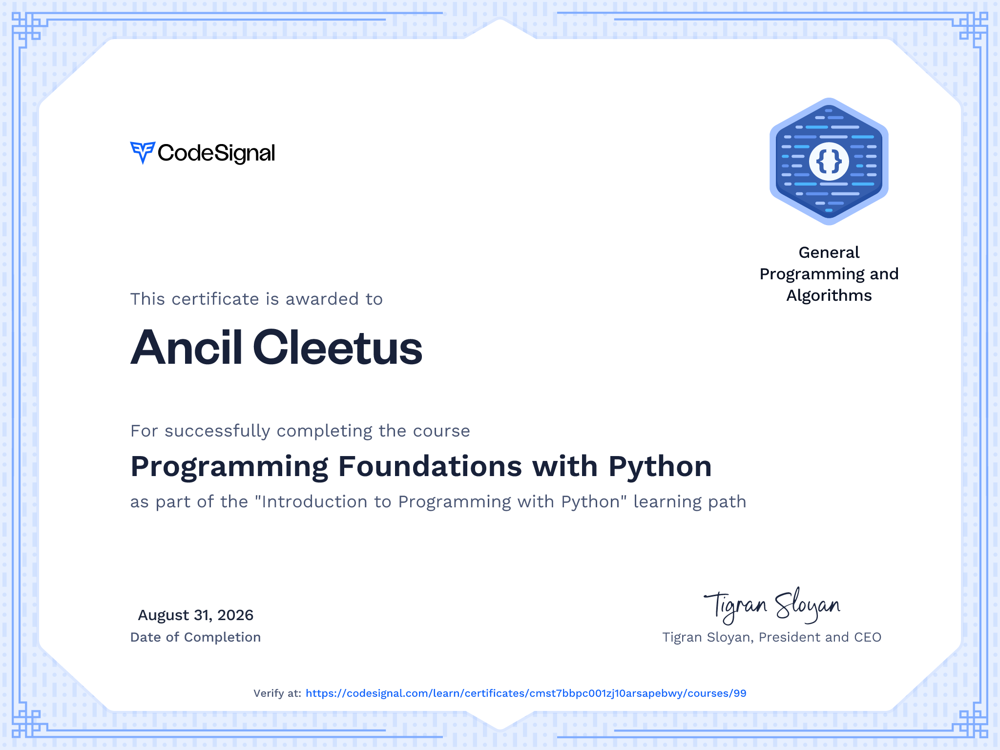
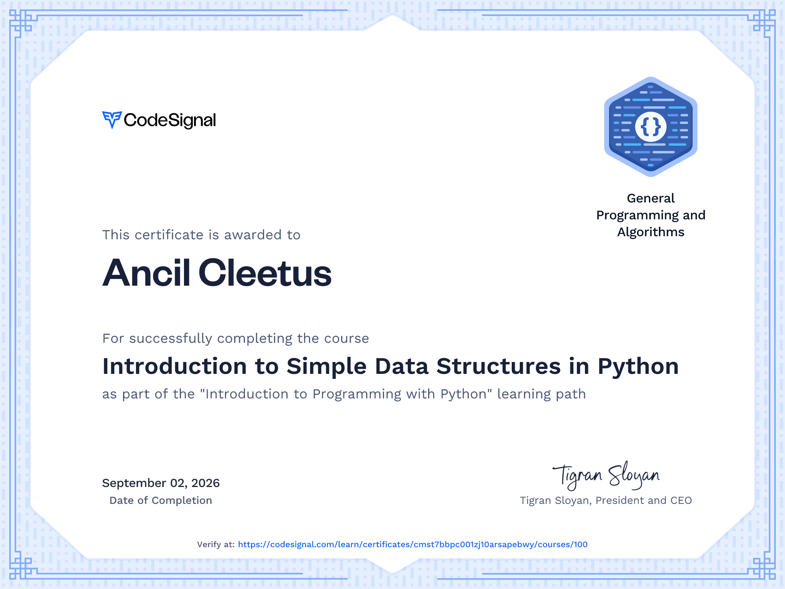

# **Introduction to Programming with Python**

Start your Python programming journey with this travel-themed learning path built for beginners. Progress from “Hello, World!” to loops and functions over this series of 5 fun courses.

## Course 1: Programming Foundations with Python    

Dive into the essentials of Python programming through an engaging, beginner-friendly course. This journey starts with writing your very first program and smoothly moves into the basics of variables, data handling, and string operations. This course will help you gain the practical skills needed for foundational programming tasks.

## Course 2: Introduction to Simple Data Structures in Python    

Expand your programming knowledge by exploring simple data structures in Python. This course introduces you to lists, tuples, and dictionaries, teaching you how to create, access, and manipulate these structures effectively. Through practical examples, you'll learn the importance of each structure and when to use them in your programs.

## Course 3: Mastering Control Structures in Python

Deepen your understanding of decision-making processes in Python with this course dedicated to mastering control structures. Learn to navigate complex decision paths and handle a variety of conditions using if, else, and elif clauses. Explore how to leverage data structures in tandem with conditional logic to enhance the functionality of your programs.

## Course 4: Exploring Iterations and Loops in Python

Discover the power and flexibility of loops in Python as you learn to automate repetitive tasks. This course covers `for` loops, `while` loops, and introduces advanced concepts like loop controls and nested loops. By the end of this course, you'll be able to use loops to enhance the efficiency and complexity of your code.

## Course 5: Defining and Utilizing Functions in Python

Functions are fundamental to clean and effective coding. This course demystifies the process of creating and using functions in Python, covering everything from basic syntax and function parameters to understanding variable scope. By integrating these concepts, you'll be able to build more modular and error-resistant programs.
