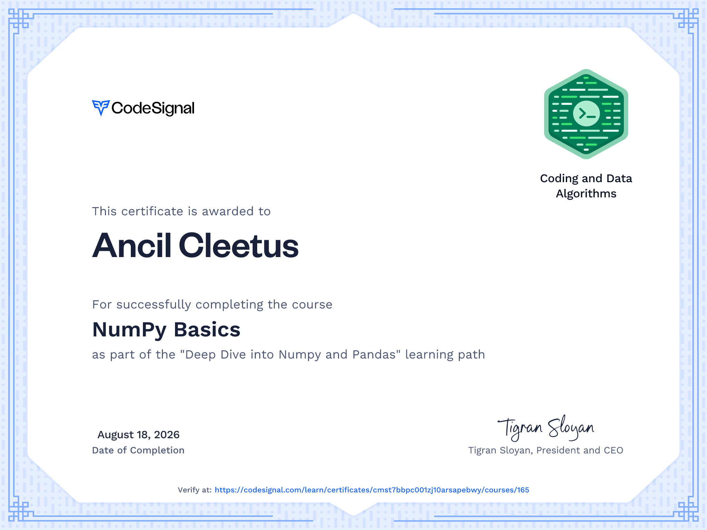
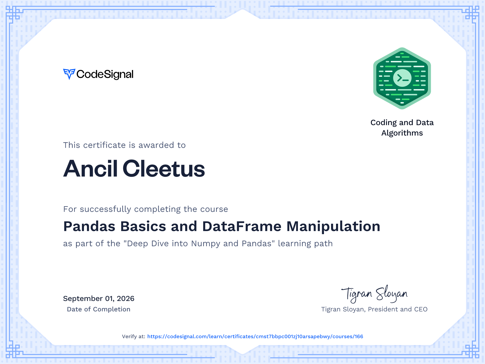

# **Deep Dive into Numpy and Pandas**

This learning path is crafted for those seeking a deep understanding of Numpy and Pandas, two cornerstone libraries in data science. These courses will immerse you in the powerful features of Numpy for numerical computing and Pandas for data manipulation.

## Course 1: NumPy Basics    

This course introduces you to the powerful NumPy library, which is the backbone for numerical and scientific computations in Python. You will learn how to create, manipulate, and operate on arrays, understand their key properties, and use array-based operations for efficient computations.

## Course 2: Pandas Basics and DataFrame Manipulation    

This course gently introduces you to the world of data manipulation using Pandas, how to load datasets, view their basic characteristics, and perform simple operations. Each code example progressively adds a new skill, aimed at beginners ready to explore data analysis with real-world datasets.

## Course 3: Introduction to Data Cleaning and Transformation    

Dive deeper into data selection and manipulation, learning how to filter datasets based on specific conditions, clean data by handling missing values, and create new derived features from existing data. Each step builds your skillset, preparing you to tackle more complex data cleaning challenges.

## Course 4: Advanced Data Analysis with Pandas

Elevate your data analysis skills by mastering advanced Pandas functionalities, including multi-level indexing, merging datasets, and performing sophisticated group-by operations. This course helps you unlock the true potential of your data through more intricate analysis techniques.

## Course 5: Data Transformation Techniques in Pandas

This course focuses on transforming your data to better suit analysis needs, including handling categorical data, performing date and time manipulations, and applying advanced filtering and sorting techniques. Through hands-on examples, you'll learn to reshape your datasets for optimized analysis.

## Course 6: Comprehensive Data Wrangling and Analysis with Pandas and Numpy

This advanced course synthesizes all previous concepts, focusing on intricate data wrangling, analysis, and transformation techniques using Pandas and Numpy. You'll learn to execute complex groupings, pivot table manipulations, and merging datasets for richer insights. The capstone project solidifies these skills, enabling you to conduct sophisticated data analysis tasks efficiently.
